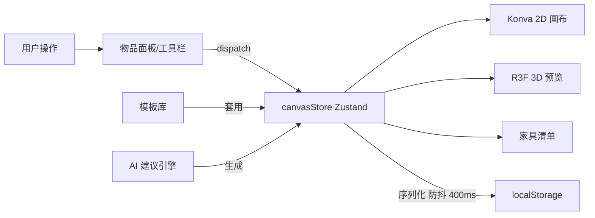

# 动森岛屿规划 App — 网页版设计方案

> 一款帮助动森（Animal Crossing: New Horizons）玩家规划岛屿布局的网页应用：
> 核心是 2D 俯视网格画布 + 模板库 + 规则式 AI 智能建议，
> 配合 3D 积木预览和家具清单导出，便于玩家照图施工。

---

## 1. 产品定位与核心价值

- **目标用户**：不擅长布局、苦于反复拆建、想要风格化但没思路的动森玩家
- **核心价值**：在游戏外低成本试错，规划好再进游戏施工，省时省心
- **MVP 范围**：网页版（桌面优先 + 移动端适配），后期用 Capacitor 包装成 App

---

## 2. 核心功能（MVP）

### 2.1 2D 网格规划画布（主功能）

- 80×70 格的俯视网格（对应游戏可用建造区）
- **四个图层**：地形层 / 道路层 / 建筑层 / 装饰层（可独立显隐、锁定）
- 操作：左侧物品面板选中物品 → 网格上点击放置 → 可移动 / 旋转 / 删除
- 工具栏：选择、地形画笔（1-8 刷子尺寸）、矩形批量铺设（如沙滩、草坪）、橡皮、平移、撤销 / 重做、缩放、网格切换
- 自动保存到 localStorage（MVP 阶段无需登录）

### 2.2 模板库 / 优秀案例

- 预置 5 个起步模板：禅意日式庭院、田园农家小院、童话精灵森林、巴黎咖啡街区、现代极简广场
- 每个模板：SVG 缩略图 + 风格说明 + "套用到画布"（创建新岛屿并填入设计）
- 浏览页支持按风格 tag 筛选

### 2.3 AI 智能建议（混合方案）

- **MVP 阶段**：规则式生成器
  - 用户输入：风格偏好（5 种）+ 密度（稀疏 / 适中 / 密集）+ 区域选择（整岛 / 自定义矩形）
  - 引擎按风格 palette（如日式 = 石灯笼、竹子、樱花、石板路…）+ 布局规则（沿路径分布、边缘种树、花田簇拥）生成方案
  - 使用 `mulberry32` 可重现 PRNG，支持"重新生成一个变体""接受 100% / 50% / 25%""放弃"
- **后期扩展**：增加 LLM API 适配层，可切换到 GPT/Claude 生成布局 JSON

### 2.4 3D 积木预览

- 右侧标签页中显示，用 react-three-fiber 把 2D 数据立体化
- 简化风格：色块 + 简单几何体
  - 树 = 圆锥 + 树干
  - 花 = 茎 + 小球
  - 建筑 = 方块 + 四角锥屋顶
  - 其他物品 = 色块立方体
- OrbitControls 自由视角（旋转、平移、缩放），N 方向标识

### 2.5 家具 / 物品清单导出

- 自动统计画布上所有物品 → 按类目分组的购物清单
- 字段：物品名 / 数量 / 获取方式（商店 / DIY / 活动）/ 预估金币
- 支持导出文本 `.txt`，便于游戏内对照

---

## 3. 技术架构

### 3.1 技术栈

| 类别        | 选型                                 |
| ----------- | ------------------------------------ |
| 构建        | Vite 5 + React 18 + TypeScript 5     |
| 状态管理    | Zustand 5（含撤销 / 重做历史栈）     |
| 2D 画布     | react-konva 18（声明式 Canvas）      |
| 3D 预览     | react-three-fiber + drei             |
| 样式        | Tailwind CSS 3（自定义 leaf/sand/sky 配色） |
| 路由        | react-router-dom 6                   |
| 图标        | lucide-react                         |
| 持久化      | localStorage（MVP）→ 后期 Supabase/Firebase |
| 移动端打包  | 后期 Capacitor                       |

### 3.2 项目结构

```text
src/
  ai/
    generator.ts        # 规则式布局生成器（含 PRNG）
    styles.ts           # 5 种风格 palette 定义
    types.ts
  components/
    Canvas/             # 主画布（Konva Stage/Layers）
    Toolbar/            # 顶部工具栏
    ItemPalette/        # 左侧物品库（分类 + 搜索）
    LayerPanel/         # 图层显隐 / 锁定 / 切换
    AISuggestPanel/     # AI 建议面板
    Preview3D/          # 3D 立体预览
    FurnitureList/      # 物品清单与导出
  data/
    items.ts            # 物品库（精选 ~50 件）
    templates.ts        # 5 个起步模板（用 seed 生成）
  pages/
    HomePage.tsx        # 首页（新建 / 续作 / 模板入口）
    EditorPage.tsx      # 编辑器（三栏布局）
    GalleryPage.tsx     # 模板库
  stores/
    canvasStore.ts      # 画布状态 + 撤销重做
    uiStore.ts          # UI 状态（右侧标签页、面板展开）
  utils/
    grid.ts             # 网格坐标 / 碰撞 / 区域工具
    storage.ts          # localStorage 序列化
  types.ts              # 全局类型与常量
  App.tsx
  main.tsx
  index.css             # Tailwind + 自定义组件类
```

### 3.3 核心数据模型

```ts
type LayerId = 'terrain' | 'path' | 'building' | 'decoration';

interface PlacedItem {
  id: string;
  itemKey: string;        // 关联 items 数据
  layer: LayerId;
  x: number; y: number;   // 网格坐标
  w: number; h: number;   // 占格大小
  rotation: 0 | 90 | 180 | 270;
}

interface IslandDesign {
  id: string;
  name: string;
  size: { cols: 80; rows: 70 };
  items: PlacedItem[];
  terrain: number[][];    // 80x70，存地形枚举（草/水/沙/悬崖层数/路面）
  createdAt: number;
  updatedAt: number;
}
```

### 3.4 数据流概览



---

## 4. 页面与交互

- **首页 `/`**：欢迎语 + "新建岛屿" / "浏览模板" / "继续上次" 三个入口；下方展示已有的"我的设计"卡片
- **编辑器 `/editor/:id`**：主战场，三栏布局
  - 左：物品面板（标签：建筑 / 桥梁 / 坡道 / 树木 / 花草 / 栅栏 / 家具 / 装饰 + 搜索）
  - 中：画布 + 顶部工具栏 + 底部坐标 / 缩放条
  - 右：可切换面板（图层 / AI 建议 / 3D 预览 / 清单）
- **模板库 `/gallery`**：网格卡片 + 风格筛选 chip
- 移动端（< 768px）：左右面板变成浮层覆盖，底部出现 "物品 / 面板" 切换按钮

---

## 5. 开发里程碑

| 阶段 | 内容 | 状态 |
| ---- | ---- | ---- |
| **M0** 脚手架 | Vite + React + TS + Tailwind + Zustand + router | ✅ |
| **M1** 画布 MVP | Konva 80×70 网格、缩放平移、地形笔刷 / 矩形、撤销重做栈 | ✅ |
| **M2** 物品系统 | ~50 件精选物品 JSON、面板分类与搜索、放置 / 选中 / 旋转 / 删除 | ✅ |
| **M3** 图层与持久化 | 四图层显隐 / 锁定 / 切换、序列化、自动保存、多岛屿管理 | ✅ |
| **M4** 模板库 | 5 个起步模板、模板库页面、"套用" 与首页打通 | ✅ |
| **M5** AI 规则引擎 | 5 种风格 palette、布局算法、整岛 / 局部、变体与部分接受 | ✅ |
| **M6** 3D 预览 | R3F + drei、几何体生成、视角控制 | ✅ |
| **M7** 物品清单 | 聚合统计、获取方式与金币、文本导出 | ✅ |
| **M8** 打磨 | 移动端响应式、性能优化（memoization、稀疏网格线）、空状态、快捷键 | ✅ |

### 键盘快捷键

| 键 | 功能 |
| --- | --- |
| `V` | 选择工具 |
| `B` | 地形画笔 |
| `E` | 橡皮 |
| `H` | 平移 |
| `R` | 旋转选中物品 |
| `Ctrl/Cmd + Z` | 撤销 |
| `Ctrl/Cmd + Y` / `Ctrl/Cmd + Shift + Z` | 重做 |
| `Delete` / `Backspace` | 删除选中 |
| `Esc` | 取消选择 |

---

## 6. 关键技术风险与对策

| 风险 | 对策 |
| ---- | ---- |
| **画布性能**：80×70 = 5600 格 + 物品图层。Konva 默认逐节点渲染，物品较多时可能掉帧 | 仅渲染非草地的地形 cell、网格线只画偶数行 + 8 倍数加粗、`perfectDrawEnabled={false}`、`listening={false}` 关闭命中测试；后期物品 > 数百时切到 PixiJS 或对静态层 `cache()` |
| **物品数据规模**：完整 ACNH 物品数千件，MVP 不必铺全 | 先精选 ~50 件高频常用（含 DIY / 家具 / 建筑 / 树花），后期可接 Nookipedia API |
| **AI 规则引擎质量**：纯规则容易"机械感强" | 用 `mulberry32` 可重现 PRNG，每次"换一个"随机新种子；引擎按"中央路径 + 上下分布锚点 + 边缘种树 + 路边花簇"分层放置；允许 100% / 50% / 25% 部分接受 |
| **3D 与 2D 数据同步** | 保持单一数据源（canvasStore），3D 仅做"读视图"，无独立状态 |
| **后期移动端** | CSS 早期就按 Tailwind 响应式类（`max-md:` 等）设计，避免后期重写；面板可浮层化 |
| **AI 接受后 ID 冲突** | 拆分 `appendItems`（保留已有 ID）和 `setTerrain`，不通过 `applyTemplate` 整批替换以避免选中状态丢失 |

---

## 7. Roadmap（实施后扩展）

- [ ] 接入 LLM API（GPT / Claude）：在 `src/ai/` 下添加适配器，由用户在设置中切换；AI 输出 JSON 后复用现有的 `appendItems` 接口
- [ ] 扩充至完整 Nookipedia 物品库（异步加载 + 虚拟化列表）
- [ ] 云端保存与分享链接（Supabase / Firebase）
- [ ] React Native / Capacitor 打包为移动端 App
- [ ] 拼接相邻 Acre 的概念（16×16 一格，更贴合游戏建造单位）
- [ ] 自定义路径花纹（QR / 设计号导入）
- [ ] 物品多语言（中 / 英 / 日）
- [ ] 缩略图自动生成（用 Konva `toDataURL`）并存进 design 元数据
- [ ] 性能：物品 > 200 时切到 PixiJS 或对图层 `cache()`

---

## 8. 关键决策记录

| 决策点 | 选择 | 理由 |
| ----- | ---- | ---- |
| 画布技术 | react-konva（vs PixiJS / SVG） | 声明式 React 友好，MVP 规模够用，迁移成本低 |
| 状态管理 | Zustand（vs Redux / Jotai） | 轻量、订阅细粒度高、易写撤销 / 重做 |
| AI 路线 | 规则式 + 后期 LLM（vs 纯 LLM） | 零成本上线、用户体验可预测，LLM 留作"高级模式"切换 |
| 3D 风格 | 积木化简化（vs 拟真模型） | 不踩任天堂版权红线、加载快、足以表达空间感 |
| 持久化 | localStorage（vs 立即上云） | 无需登录、零后端，专注核心功能验证 |
| 物品规模 | 精选 50 件（vs 全量） | MVP 验证布局逻辑足够；扩量时数据驱动无需改架构 |
